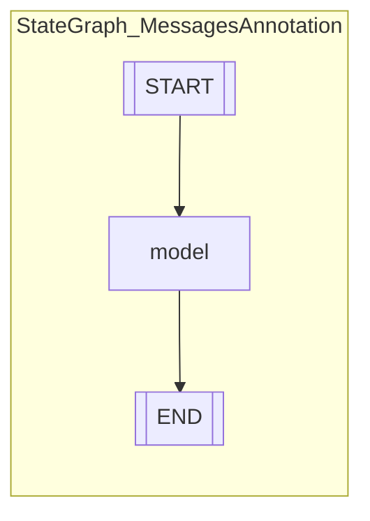
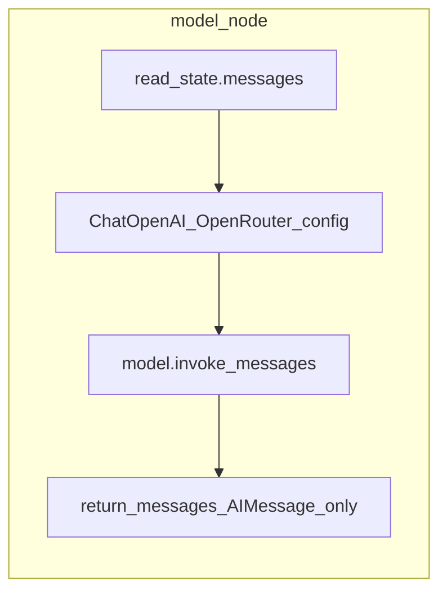
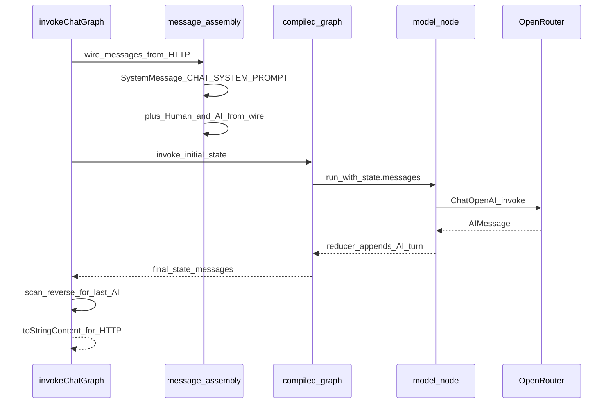

# ADR 0001: LangGraph chat graph (canonical record)

## Status

Accepted

## Context

This ADR is the **primary artifact** we keep current as the product evolves. The **compiled LangGraph** in `apps/server/src/graph/chat-graph.ts` is the source of truth for how a chat turn is orchestrated. HTTP (Fastify), the React client, and shared packages are **auxiliary**: they deliver bytes to and from the graph but do not define orchestration logic.

**Non-goals in the current graph (document explicitly when you change them):** no checkpointer, no branching routers, no human-in-the-loop interrupts, no tool nodes, no streaming events—only a single LLM node and linear control flow.

---

## Canonical implementation

| Item | Location |
|------|----------|
| Graph definition + compile + `invokeChatGraph` | [`apps/server/src/graph/chat-graph.ts`](../apps/server/src/graph/chat-graph.ts) — exports `compiledChatGraph` |
| Programmatic Mermaid + HTML wrapper | [`apps/server/src/graph/graph-diagram.ts`](../apps/server/src/graph/graph-diagram.ts) — `compiledChatGraph.getGraphAsync()` then `Graph.drawMermaid()` from `@langchain/core`; served at `GET /api/graph/diagram` |
| System instructions (injected before invoke) | [`apps/server/src/prompts/chat.ts`](../apps/server/src/prompts/chat.ts) — `CHAT_SYSTEM_PROMPT` |

---

## Graph topology

The runtime object is a **`StateGraph`** built on **`MessagesAnnotation`**: state is primarily the **`messages`** channel (LangChain message list with the default append reducer).

**Nodes**

| Node id | Responsibility |
|---------|----------------|
| `model` | Read `state.messages`, call `ChatOpenAI.invoke`, return `{ messages: [response] }` so the new assistant turn is appended to state. |

**Edges**

| From | To |
|------|-----|
| `START` | `model` |
| `model` | `END` |

**Lifecycle**

- The graph is **compiled once** at module load (`const graph = ... .compile()`).
- Each HTTP chat request calls **`invokeChatGraph(wireMessages)`**, which builds the **initial** message list (see next section) and runs **`graph.invoke({ messages: [...] })`** once.

### Diagram: control flow inside the compiled graph

### Diagram: what happens inside the `model` node

OpenRouter is reached via `configuration.baseURL` = `https://openrouter.ai/api/v1` and `OPENROUTER_API_KEY`. Optional headers: `HTTP-Referer`, `X-Title` from env.

---

## Message assembly and extraction (invoke boundary)

**Important distinction:** `CHAT_SYSTEM_PROMPT` is **not** added inside the `model` node. It is prepended in **`invokeChatGraph`** before `graph.invoke`. The graph’s `model` node only sees whatever is already in `state.messages` (system + human/ai turns).

Wire format from the HTTP layer: `{ role: "user" | "assistant", content: string }[]` — mapped to `HumanMessage` / `AIMessage`.

### Diagram: end-to-end message flow for one `invoke`

### Extraction rule

After `invoke`, the HTTP layer uses the **last message** in final state whose `getType() === "ai"` and normalizes `content` to a string (`toStringContent`). If none is found, throw.

---

## State shape (conceptual)

`MessagesAnnotation` tracks:

- **`messages`**: ordered list of LangChain messages; each `model` invocation appends the new assistant message per the node return value.

There is **no** custom channel (e.g. `retrievalContext`, `toolCalls`) in the current graph—adding one is a deliberate ADR-worthy change.

---

## Auxiliary systems (not the tracking focus)

Keep these minimal in documentation; update only when they affect **how** the graph is invoked or configured.

| Area | Role relative to the graph |
|------|----------------------------|
| **Fastify** (`apps/server/src/index.ts`) | Validates body, calls `invokeChatGraph`, maps errors to HTTP; graph viz at `GET /api/graph/diagram` (HTML), using LangGraph’s drawable graph API. |
| **Zod** (`apps/server/src/schemas/chat.ts`) | Ensures wire roles are only `user` / `assistant` (no client `system`). |
| **Welcome endpoint** | `GET /api/chat/welcome` serves static copy; **does not** run the graph. |
| **Client** (`apps/chat`) | Fetches welcome, posts message history to `POST /api/chat`; dev Vite proxy forwards `/api` to the server. |
| **Monorepo** | pnpm workspaces + Turbo; graph code lives under `apps/server`. |

---

## Evolution checklist (when you change the graph)

Update **this ADR** when you:

- Add/remove/rename nodes or edges (Mermaid from `drawMermaid` updates automatically; refresh narrative diagrams in this ADR if you keep them).
- Change state annotation or reducers.
- Move system prompt injection (e.g. into a dedicated node).
- Add tools, retrieval, branching, persistence, or streaming.
- Change OpenRouter/model configuration ownership (env vs graph vs node).

---

## Related documentation

- Root [`README.md`](../README.md) — env vars and dev proxy (auxiliary).
- [`adr/README.md`](README.md) — ADR index.
